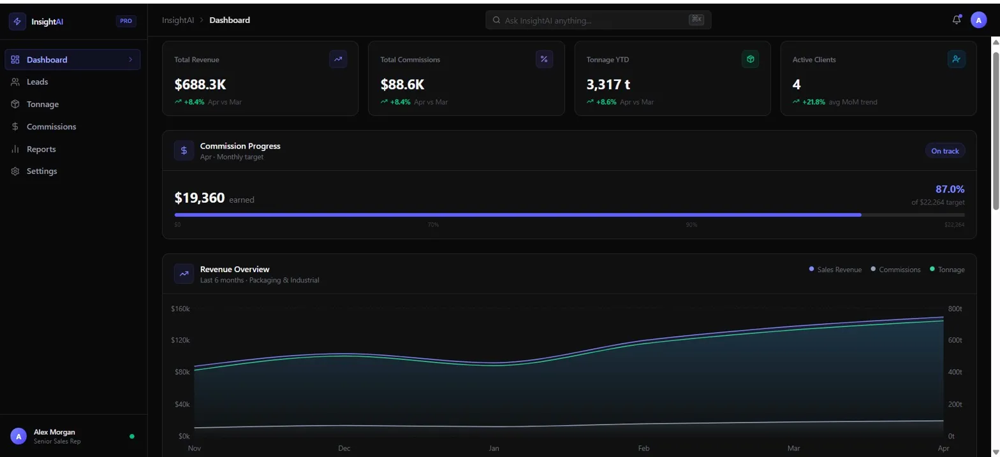
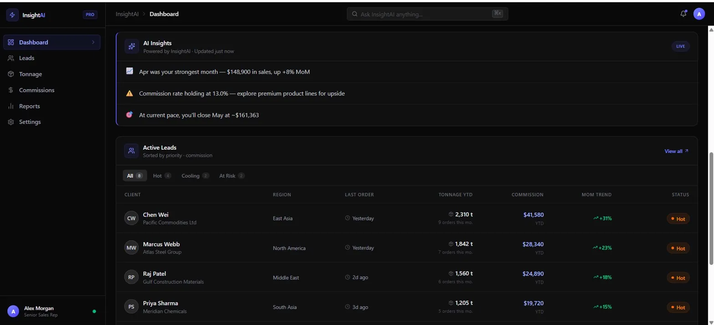

# InsightAI Pro

> Elite Business Intelligence dashboard for Commercial Representatives — built with the design quality of Linear and Vercel, powered by real sales data.

[](https://react.dev)
[](https://typescriptlang.org)
[](https://tailwindcss.com)
[](https://vitejs.dev)
[](https://insight-ai-pro-pink.vercel.app/)

🚀 **Live Demo:** [insight-ai-pro-pink.vercel.app](https://insight-ai-pro-pink.vercel.app/)
🔗 **Repository:** [github.com/rubensbmelo/insight-ai-pro](https://github.com/rubensbmelo/insight-ai-pro)




---

## Business Context

Commercial representatives managing high-volume sales — packaging materials, industrial goods, bulk commodities — have a problem: their tools are stuck in the past. Bloated ERPs, confusing spreadsheets, and zero visual feedback on what's actually happening with their pipeline.

**InsightAI Pro** closes that gap. It gives sales reps a single, fast, beautiful interface to answer the questions that matter every morning:

- Who are my most profitable clients right now — and who is going cold?
- Am I on track to hit my commission target this month?
- Is my tonnage trending up or down compared to last quarter?
- What should I focus on today to protect my numbers?

The AI Insight engine analyzes revenue trends automatically, surfacing patterns the human eye misses — commission rate drift, MoM growth acceleration, and forward projections for the next month.

This is not a generic dashboard template. Every metric, every label, and every data model was designed around the real workflow of a commercial rep working international accounts.

---

## Features

- 📊 **KPI Cards** — Total Revenue, Commissions, Tonnage YTD, and Active Clients with real MoM deltas
- 📈 **Revenue Overview Chart** — 6-month area chart with smooth gradients, invisible grid, and dual Y-axis for Sales + Tonnage
- 🎯 **Commission Progress** — animated progress bar with shimmer effect, dynamic color zones (on track / warning / critical), and a live target computed from historical data
- 🔥 **Active Leads Table** — clients sorted by urgency (Hot / Cooling / At Risk) with relative timestamps, tonnage, and commission values at a glance
- 🤖 **AI Insight Card** — dynamically computed insights from real data: best month, commission rate health, and a forward projection for the next month
- ✨ **Framer Motion** — staggered fade-in animations on all cards and table rows for a premium software feel
- 🌙 **Dark Elite Theme** — `#09090b` background, Indigo + Zinc accent system, consistent across every component

---

## Tech Stack

| Layer | Choice | Why |
|---|---|---|
| Bundler | Vite 8 | Sub-second HMR, modern ESM output |
| Framework | React 19 | Latest concurrent features |
| Language | TypeScript ~6 | Strict mode, no `any`, interfaces everywhere |
| Styling | Tailwind CSS v4 | CSS-native config, `@import "tailwindcss"`, zero purge issues |
| Charts | Recharts 3 | Composable SVG charts, full control over gradients and tooltips |
| Animation | Framer Motion 12 | Production-grade spring animations, `AnimatePresence` for layout transitions |
| Icons | Lucide React | Consistent 1px stroke icon system |
| Utilities | clsx + tailwind-merge | Safe class composition without conflicts |

### Tailwind v4 Notes

This project uses **Tailwind CSS v4** with the new CSS-native approach:

- Entry point is a single `@import "tailwindcss"` — no `@tailwind base/components/utilities` directives
- PostCSS is handled via `@tailwindcss/postcss` (separate package required in v4)
- Theme tokens are emitted as CSS custom properties automatically (`var(--color-zinc-50)`)
- All Tailwind class names are static string literals — no dynamic template construction, ensuring correct tree-shaking

### Recharts Architecture

- `AreaChart` with `ResponsiveContainer` for fluid layout
- `linearGradient` fills defined in `<defs>` — top opacity ~0.30, bottom bleeds to 0.01 for depth
- Dual `YAxis` (`yAxisId="left"` for USD, `yAxisId="right"` for tonnage) — different scales, no visual collision
- Custom `Tooltip` built with inline styles — Recharts portals the tooltip outside the React tree
- `vertical={false}` on `CartesianGrid` + `stroke="rgba(255,255,255,0.06)"` for the invisible grid effect

---

## Project Structure

```
src/
├── components/
│   ├── layout/
│   │   └── Shell.tsx           # Sidebar + TopBar (AI Command Bar) + mobile drawer
│   └── dashboard/
│       ├── KPICards.tsx        # Four metric cards with staggered animation
│       ├── CommissionGap.tsx   # Progress bar with shimmer + dynamic color zones
│       ├── RevenueChart.tsx    # Area chart with gradients and custom tooltip
│       ├── AIInsightCard.tsx   # Dynamically computed AI insights
│       └── ActiveLeads.tsx     # Filterable leads table with status badges
├── data/
│   ├── revenueData.ts          # RevenueDataPoint interface + 6-month mock data
│   └── leadsData.ts            # Lead interface + 8 international client entries
└── App.tsx                     # Root layout, navigation state
```

---

## Getting Started

```bash
# Clone the repository
git clone https://github.com/rubensbmelo/insight-ai-pro.git

# Navigate into the project
cd insight-ai-pro

# Install dependencies
npm install

# Start the development server
npm run dev
```

Run `npm run dev` and open the local URL shown in your terminal.

---

## Roadmap

This project is the foundation for a real SaaS product. Planned next phases:

- [ ] **Auth** — Supabase Auth with role-based access (Rep / Manager / Admin)
- [ ] **Live Data** — Supabase Postgres backend replacing mock data
- [ ] **Multi-Rep Support** — manager view aggregating performance across a sales team
- [ ] **AI Command Bar** — functional `⌘K` palette with natural language queries ("Show me clients with declining tonnage")
- [ ] **Export** — PDF commission reports and CSV data export
- [ ] **Mobile App** — React Native port for reps in the field

---

## License

MIT — free to use as a reference or starting point.

---

<p align="center">Built as a black-belt portfolio project targeting international clients on Upwork and Freelancer.com</p>